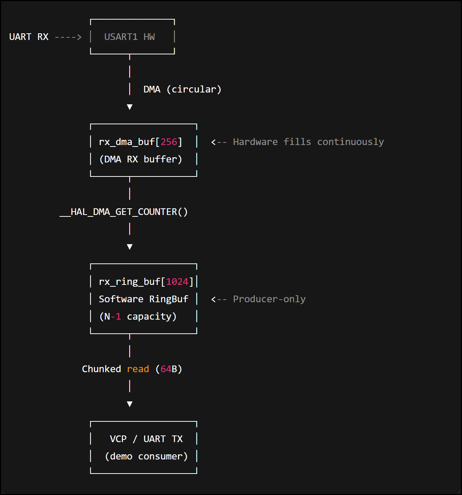

# NuH755_UART_DMA

STM32H7 UART RX DMA experiment demonstrating a **high-throughput,
producer-driven ring buffer design** to prevent UART RX overrun.

This project explores how to reliably receive continuous UART data using
**circular DMA + software ring buffer**, even when the consumer side
(e.g. `printf()` / VCP output) cannot keep up in real time.

---

## Motivation

On STM32H7, UART RX with DMA can easily overrun when:

- RX data rate is high
- RX data is forwarded via `printf()` / VCP
- Consumer-side processing is slow or blocking

This repository demonstrates a **producer-first design**:

> DMA always receives → software ring buffer absorbs bursts → consumer drains in chunks

The key idea is to **decouple RX reliability from consumer performance**.

---

## Key Concepts

- Circular DMA RX buffer
- Producer-only software ring buffer
- DMA write position tracking via `__HAL_DMA_GET_COUNTER()`
- Wrap-around safe handling
- Chunked consumer output to avoid RX congestion

---

## Architecture Overview



**Data flow:**

UART RX → Circular DMA → Software Ring Buffer → Chunked VCP Output

The RX path is fully decoupled from consumer-side blocking operations.


**Design intent:**

- RX path is **never blocked**
- DMA and producer logic always run first
- Slow / blocking output is isolated on the consumer side

---

## Current Implementation

### RX Path (Producer)

- UART1 configured with **circular DMA**
- DMA RX buffer (`rx_dma_buf`) continuously filled by hardware
- DMA write position is computed as:

```c
pos = RX_BUF_SIZE - __HAL_DMA_GET_COUNTER(huart1.hdmarx);

